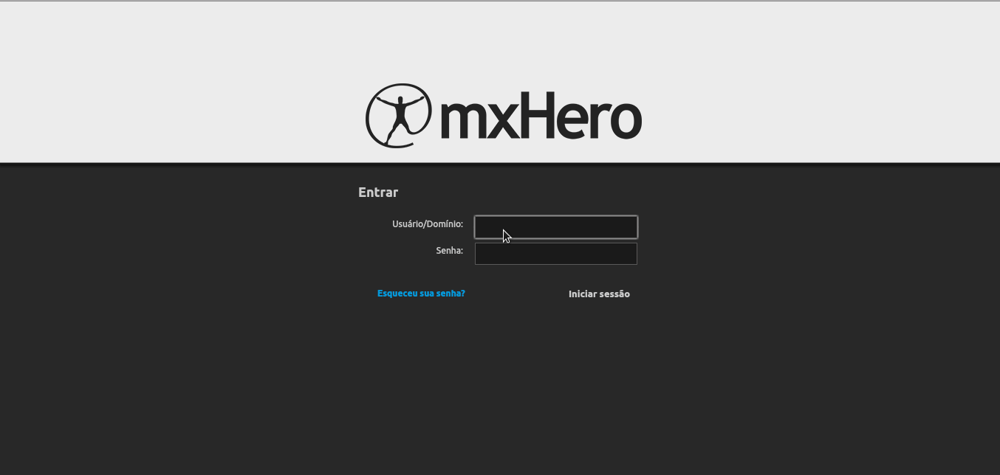

# MXGateway installer

MxGateway is an email information traffic management tool for companies and ISPs, where you can have real time email use control.


### Usage:

Clone this repo and execute the instalation script.

```sh
git clone https://github.com/inova-tecnologias/mxhero-install.git
cd mxhero-install
./install.sh
```
`./install -h` will return the following options:

```sh
MXGateway Installer
Usage: ./ubuntu16_installer.sh [ARGS]
	-h --help: Show this help menu
	-n --mynetworks: Postfix Mynetworks. Default: 10.0.0.0/8 192.168.0.0/16 127.0.0.0/8
	-a --admin: Global admin password. Default: mxheroadmin
	-m --mysql: Mysql root password. Default: root
```

#### Policies
---
 - Signature Auto
 - Block List
 - Attachment Block
 - Permitted Recipients
 - Restricted Delivery
 - Send as personal
 - Usage Hours
 - Email Size Limiter
 - BCC Policy
 - Email Address Protection
 - Redirect
 - Footer
#### Security
---
  - External Anti-spam
 - ClamAV Antivirus
 - Backup Copy
 - Read Once
 - Secure Email
#### Auditing
---
 - Content Auditing
 - Sender/ Recipient Auditing
 - BCC Usage
#### Enhancements
---
 - Reply Timeout
 - Enhanced BCC
 - Hero Attach
 - Attachment Track
#### Reports
---
 - Platform
 - Social
